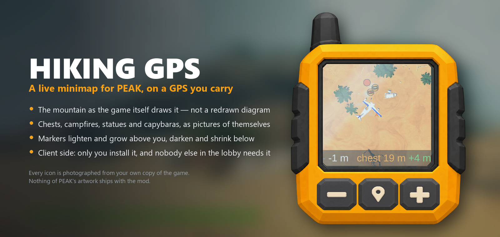
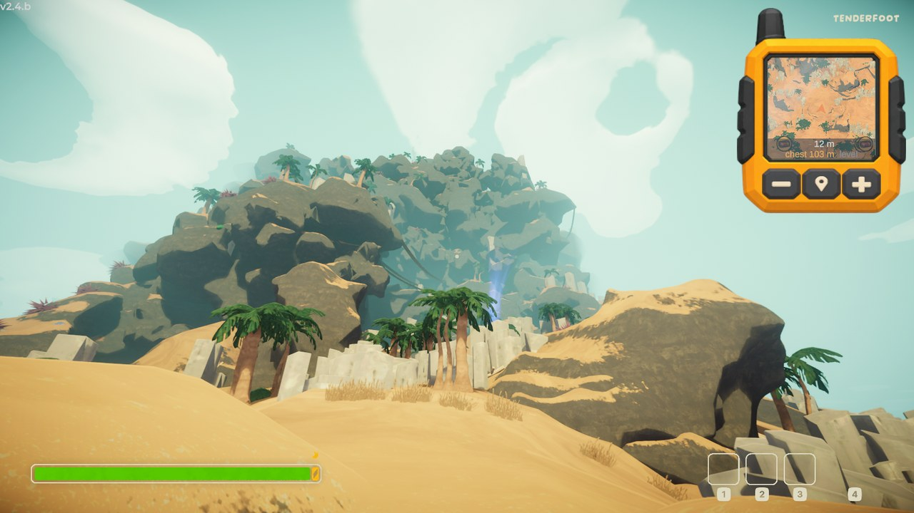

<div align="center">

# Hiking GPS

**A live minimap for PEAK, on a handheld GPS you carry.**



</div>

---

Press `M` and the mountain is there: a camera looking down at the world you are
standing in, with markers for the things worth walking towards.

- **The real mountain**, drawn by the game itself — not a redrawn diagram.
- **Chests, campfires, statues, belltowers, capybaras and the scoutmaster**,
  each shown as a picture of itself. Opened chests disappear.
- **Height.** A marker grows and lightens above you, shrinks and darkens below —
  because thirty metres sideways and thirty metres up are nothing alike here.
- **Everyone else on the climb**, at any distance.

**Client side.** Only you install it. Nobody else in the lobby needs it, and it
changes nothing anyone else sees.

**No game assets ship with it.** The GPS is drawn for this mod; marker icons are
photographed from your own copy of the game the first time you see each kind of
thing.



## Install

Install **BepInEx 5** for PEAK, then drop `HikingGPS.dll` into
`BepInEx/plugins/`. A mod manager does both for you.

## Controls

| Key | |
|---|---|
| `M` | Show or hide the GPS |
| `=` / `-` | Zoom, in fixed steps from 20 m to 2000 m across |
| `N` | Tilt: straight down, 75°, 45° |
| `F11` | Save a screenshot |

Size, corner, margins and the colour of your own arrow are all settings.
[`packaging/README.md`](packaging/README.md) is the mod's own readme and lists
them.

## Building it

Requires the [.NET SDK](https://dotnet.microsoft.com/download) 8 or newer.

```bash
dotnet build plugin/PeakMapInteractive.csproj -c Release   # build
pwsh -File tools/package.ps1                               # Thunderstore + Nexus archives
```

## The other half

This began as a web map — a plugin that measures the daily mountain and exports
it, and a browser client that renders the export as navigable 3D terrain. That
half still works and still lives here; the mod is the active one.

See [`docs/EXPORTER.md`](docs/EXPORTER.md), and
[`docs/ARCHITECTURE.md`](docs/ARCHITECTURE.md) for how the pieces fit.

```
plugin/    BepInEx plugin: the live GPS, and the snapshot exporter  (C#)
web/       3D viewer for exported snapshots                        (Three.js + Vite)
tools/     Clone setup, capture supervision, packaging, publishing (PowerShell + Node)
packaging/ What ships to Thunderstore and Nexus
docs/      Data format, architecture, automation
```

## Legal

Unofficial fan project. Not affiliated with, endorsed or sponsored by Aggro Crab
or Landfall Games. All game assets, trademarks and content remain theirs.

Source code is MIT (see [LICENSE](LICENSE)) — this code only, not captured map
data and not anything belonging to the game.

The GPS artwork in `plugin/assets` is reserved, so the mod keeps its own face.
Fork the code freely and draw your own device; if you want to use this one
anyway, ask, and the answer is likely yes.
